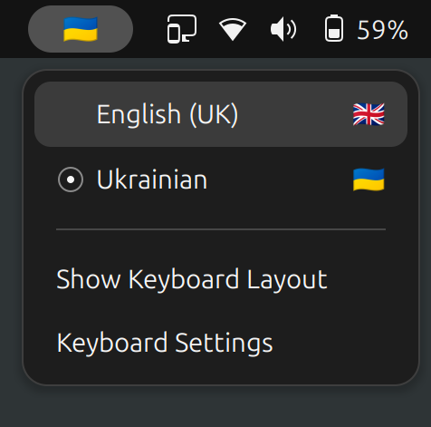

# Prapor — Keyboard Layout Indicator for GNOME Shell

A GNOME Shell extension to display the current keyboard layout as a country flag in the top panel, making it easy to see and switch between different keyboard layouts at a glance.



## Features

It's like the system GNOME Shell layout indicator, but with flags.

## Requirements

- GNOME Shell 48+

## Installation

### Manual Installation

1. **Download and install the extension files**

   ```sh
   git clone https://github.com/inbalboa/gnome-prapor.git
   cd gnome-prapor
   make install
   ```

2. **Restart GNOME Shell**

   Log out and log back in.

3. **Enable the extension**
   ```sh
   gnome-extensions enable prapor@inbalboa.github.io
   ```

## Usage

Once installed and enabled, the flag icon in the top panel shows your current keyboard layout.

Click the flag to open a dropdown menu with all available layouts.

You can still use your regular keyboard shortcuts (e.g., `Super + Space`) to switch layouts.

## Configuration

You can hide the system keyboard layout indicator (with letters) in the extension settings page.

## Troubleshooting

### Extension Not Showing
- Ensure GNOME Shell version is 48 or higher
- Check that the extension is enabled: `gnome-extensions list --enabled`
- Restart GNOME Shell

### Wrong Flag Displayed
- The extension maps layouts based on their identifier
- Some layouts may use generic identifiers that don't map perfectly to countries
- Unknown layouts will display a keyboard emoji (⌨️)

### No Layouts in Menu
- Ensure you have multiple keyboard layouts configured in Settings
- Check that Input Sources are properly configured
- Restart the extension: disable and re-enable it

## License

This project is licensed under the GPL-3.0 License - see the [LICENSE](LICENSE) file for details.

## Changelog

### Version 1.0.0
- Initial release
- Support for 60+ keyboard layouts
- Flag display and layout switching functionality
- XKB and IBus input method support

## Support

If you encounter any issues or have suggestions for improvements:

1. Check the [Issues](https://github.com/inbalboa/gnome-prapor/issues) page
2. Create a new issue with detailed information about your problem
3. Include your GNOME Shell version and keyboard layout configuration

